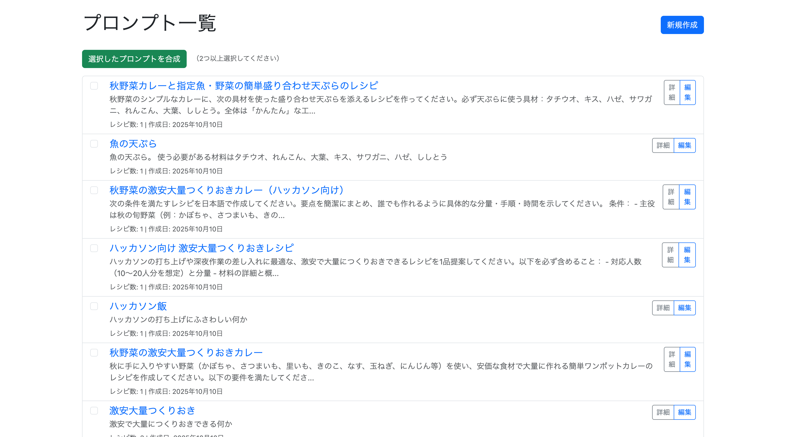
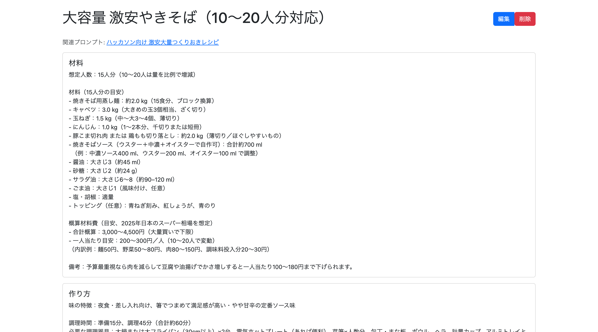

# hlunch

ハルシネーション・ランチ




## 開発環境セットアップ

```bash
cp .env.example .env
vim .env # OpenAIのAPIキーが必要です
bin/dev
```

## 概要

料理レシピ生成を目的としたLLMアプリケーション

- ユーザーはプロンプトを保存できる
- 保存したプロンプトからLLMを使ってレシピを生成し保存できる
- プロンプト同士をLLMに合成させて新たなプロンプトを生成できる
